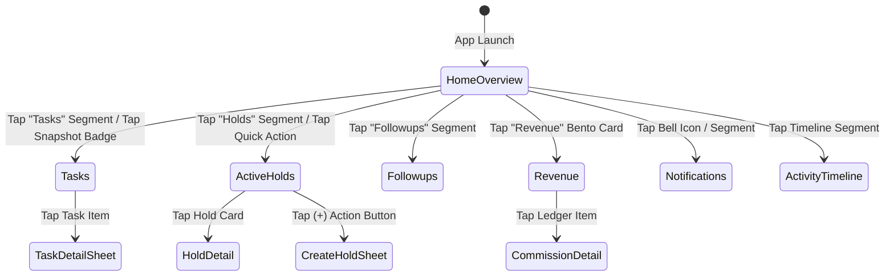

# Hunt Inventory Home Module Design Documentation
**Modern FinTech SaaS Style Onboarding & Enterprise Dashboard**

Inspired by premium applications like Stripe Identity, Brex, and Linear, this document defines the user experience, architecture, and layouts for the 7 dashboard screens in the Home Module.

---

## 1. Information Architecture (IA)

```mermaid
graph TD
    HomeModule[Home Module /dashboard] --> Header[Dynamic Greeting Header]
    HomeModule --> Nav[Horizontal Segmented Tab Controller]
    
    Nav --> Tab1[1. Home Overview]
    Nav --> Tab2[2. Tasks Dashboard]
    Nav --> Tab3[3. Active Holds]
    Nav --> Tab4[4. Followups]
    Nav --> Tab5[5. Revenue]
    Nav --> Tab6[6. Notifications]
    Nav --> Tab7[7. Activity Timeline]

    Tab1 --> Snap[Daily Snapshot]
    Tab1 --> Actions[Quick Action Grid]
    Tab1 --> Pinned[Pinned Projects Scroll]
    Tab1 --> Updates[Builder Updates Feed]

    Tab2 --> Progress[Goal Progress Indicator]
    Tab2 --> TaskList[Categorized Task List: Due, High, Complete]
    
    Tab3 --> HoldCards[Holds Grid with Countdown Timers]
    Tab3 --> Waitlist[Waitlist Queue Positions]
    
    Tab4 --> Timeline[Followups Schedule Timeline]
    Tab4 --> ActionCall[Thumb-friendly Contact Actions]
    
    Tab5 --> Bento[Financial Bento available/pending/YTD]
    Tab5 --> Charts[SVG Sales Volume Chart]
    Tab5 --> Ledger[Recent Commissions Ledger]
    
    Tab6 --> NotifList[Filtered Notification Feed]
    
    Tab7 --> AuditTrail[Broker Action Timeline Logs]
```

---

## 2. User & Screen Flow

### User Flow: KYC / Onboarding Task Verification
1. **Trigger**: User opens app -> Lands on **Home Overview**.
2. **Action**: Daily Snapshot badge flags "2 pending KYC tasks".
3. **Transition**: Tap on "Tasks" tab in the segmented controller.
4. **On Screen**: User views the **Tasks Dashboard**.
5. **Action**: User taps on "Verify KYC selfie document" task.
6. **Sheet / Slide-over**: Interactive scanner simulation slides up.
7. **Complete**: Action submitted -> Progress bar animate-updates from 60% to 80% (Goal Gradient Effect).

### Screen Flow Map

---

## 3. Component Inventory

### Layout & Containers
- **Main Container**: Mobile layout (`393px` width, `851px` height simulated Samsung S23 Ultra/iPhone screen bezel).
- **Surface Cards**: Large radius (`24px` / `28px`), pure white (`#FFFFFF`) backgrounds floating on soft shadows over `#F6FBF8` background.
- **Top Sticky Header**: Floating glassmorphism header with user profile, CP ID (`CP-8042`), and trust rating.
- **Segmented Controller**: Horizontal scrolling navigation bar containing 7 segments with active mint green backgrounds.

### Control Primitives
- **Button Primary**: Large radius (`16px`), background `#24C97B`, text `#FFFFFF`, bold styling.
- **Badge Status**: 
  - `Available`: green text on green soft backdrop (`bg-status-available/10 text-status-available`).
  - `Held`: orange text on orange soft backdrop (`bg-status-held/10 text-status-held`).
  - `Sold` / `Blocked`: dark text on dark green soft backdrop.
- **Progress Bars**: Radix-based custom progress indicators.

---

## 4. UX Law Applications

### Jakob's Law
- **Design**: Tab segments at the top and standard bottom navigators mirror patterns users know from Spotify, Airbnb, and Brex.
- **Outcome**: Immediate user familiarity, zero learning curve.

### Hick's Law
- **Design**: Categorized the dashboard into 7 distinct screens rather than displaying a massive scrolling dashboard.
- **Outcome**: Lower cognitive load, quick user focusing on tasks.

### Fitts's Law
- **Design**: Actionable elements (like "Place Hold", "Log Call", and bottom navigation) utilize large targets (`14px` height padding) placed within standard mobile thumb reach.
- **Outcome**: Easy one-handed usage.

### Miller's Law
- **Design**: Info is chunked into 7 tabs. Humans can keep `7 ± 2` items in short-term memory.
- **Outcome**: Cleaner memory retrieval and screen scanning.

### Goal Gradient Effect
- **Design**: The closer the user is to a target, the faster they work. Tasks & Revenue sections show progress meters (e.g. `83% toward bonus`).
- **Outcome**: Increased engagement and speed to target completion.
