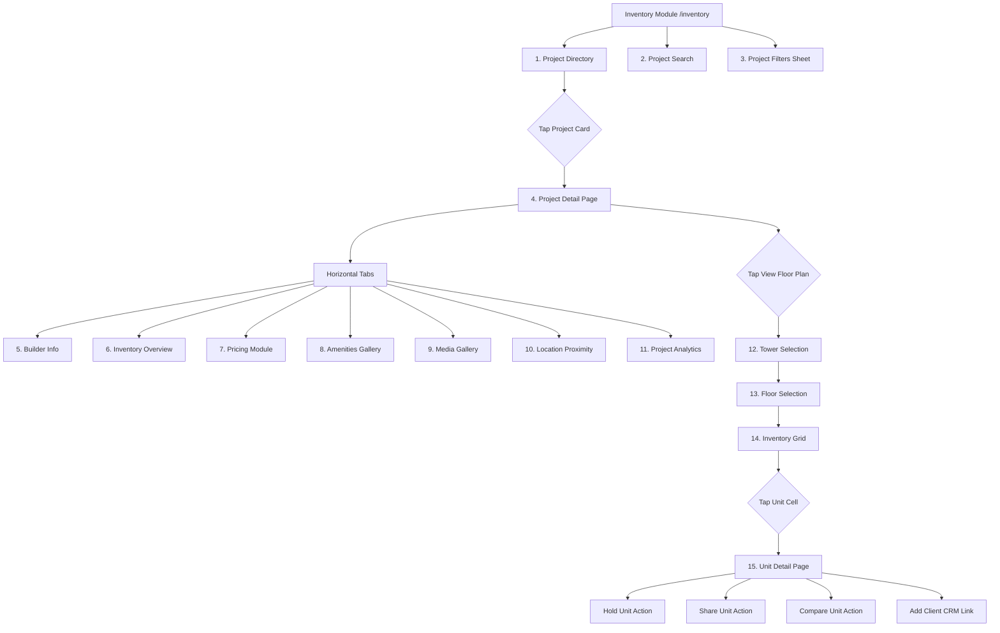

# Hunt Inventory Project Module Design Documentation
**Stripe Identity & Brex Inspired Mobile Inventory Architecture**

A high-fidelity mobile flow mapping 15 distinct screens into a unified, task-oriented inventory experience.

---

## 1. Information Architecture (IA)

---

## 2. Screen Mapping & Flow

### Screens 1, 2, 3: Directory, Search & Filters
- **Path**: `/inventory` (implemented in `InventoryHomePage.tsx`)
- **Interaction**: Features an autocompleting search bar and a bottom filter sheet covering project status, available unit volume, location tags, and commission scales.

### Screens 4 - 11: High-fidelity Project Detail
- **Path**: `/inventory/project/:id` (implemented in `ProjectDetailPage.tsx`)
- **Interaction**: Uses a horizontal scrolling segmented tab control at the top to switch between 8 sub-panels:
  - **Overview**: Base RERA, launch dates, construction status.
  - **Builder**: Profile, rating, and delivered projects volume.
  - **Inventory**: Graphic summary count of available/held/reserved/sold inventories.
  - **Pricing**: PLC (Preferential Location Charges), club charges, tax estimates.
  - **Amenities**: Filterable amenities with minimal icons.
  - **Gallery**: Image swipe deck.
  - **Location**: Proximity scores (transit, healthcare, retail).
  - **Analytics**: Historical price graphs and demand velocity.

### Screens 12 - 14: Tower & Floor Plan Selector
- **Path**: `/inventory/project/:id/towers` (implemented in `TowerFloorPlanPage.tsx`)
- **Interaction**: First selects the Tower, then uses a floor picker (vertical scroll list) to load the color-coded **Inventory Grid** cells showing real-time unit availabilities.

### Screen 15: Unit Details
- **Path**: `/inventory/unit/:id` (implemented in `UnitDetailPage.tsx`)
- **Interaction**: Standard specifications (facing, carpet area, base price, maintenance) with action controls anchored in the thumb reach zone (Place Hold, WhatsApp Share, Compare, Link CRM Client).

---

## 3. UX Laws Applied

### Progressive Disclosure
- Project statistics (pricing formulas, builder bios, location scores) are tucked under tab panels so that brokers are not overwhelmed during initial property comparisons.

### Hick's Law
- Grid search filters and floor grid selectors are decoupled, directing the broker step-by-step from project to tower, then floor, and finally unit.

### Fitts's Law
- Main CTA actions (like the primary "Lock Hold" button and tab buttons) are full-width buttons sitting in the screen's safe bottom navigation zone.

### Goal Gradient Effect
- The hold timer countdown (e.g. "Expires in 14h 22m") acts as a visual prompt, urging both the broker and buyer to submit booking documents before the lock expires.
